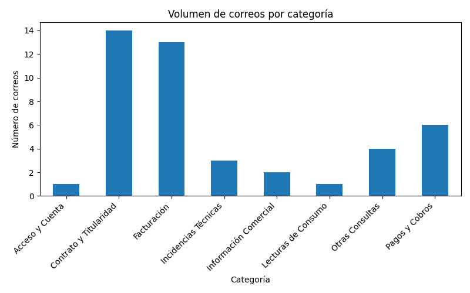
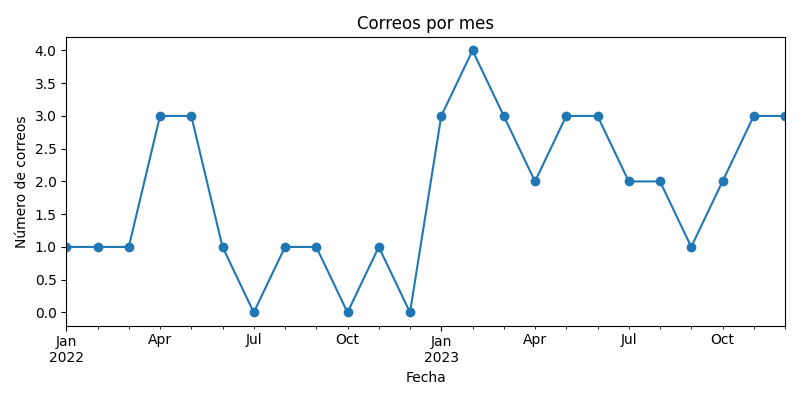
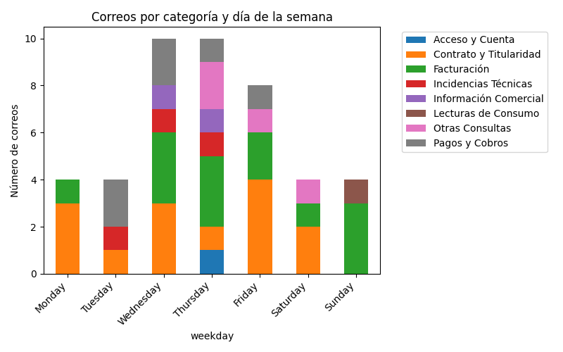

# INFORME DE RESULTADOS – PARTE 2

Análisis y Recomendaciones sobre Correos Categorizados

---

## 1. Exploración de Datos

### a) Volumen de correos por categoría

El análisis de los **45 correos electrónicos categorizados** muestra la siguiente distribución temática:

**Gráfico 1: Volumen de correos por categoría**

* **Contrato y Titularidad:** 14 correos
* **Facturación:** 13 correos
* **Pagos y Cobros:** 6 correos
* **Otras Consultas:** 4 correos
* **Incidencias Técnicas:** 3 correos
* **Información Comercial:** 2 correos
* **Lecturas de Consumo:** 1 correo
* **Acceso y Cuenta:** 1 correo

Se observa que las categorías de **Contrato y Titularidad** y **Facturación** concentran la mayoría de las consultas, abarcando en conjunto casi el 60% del total (27 de 45), lo que refleja la importancia de estos temas en la operativa diaria del departamento de Atención al Cliente. Las demás categorías presentan volúmenes mucho menores, aunque siguen siendo relevantes para mantener un servicio integral.

---

### b) Distribución temporal de correos

**Por mes:**
El gráfico de correos por mes revela cierta **variabilidad a lo largo de 2022 y 2023**, con picos puntuales en algunos meses (ej. marzo-abril 2022, enero-marzo 2023), pero sin una tendencia creciente o decreciente clara. No se registran meses con valores atípicamente altos ni caídas abruptas prolongadas.

No hay datos disponibles para 2024 ni 2025, lo que indica que el conjunto de correos analizados está acotado a los años previos.

**Gráfico 2: Correos por mes**

Esta distribución apunta a una actividad de consultas repartida de forma relativamente regular, aunque con cierta concentración en los primeros trimestres de ambos años. La ausencia de meses sin correos (excepto algún mes puntual) refuerza la idea de un flujo constante de incidencias y consultas.

**Nota:** Dada la limitación temporal del dataset (sólo hasta 2023), el análisis de estacionalidad y tendencias es robusto **dentro de los datos disponibles**, pero cualquier cambio futuro en la operativa requeriría validación adicional.

**Por día de la semana:**
La distribución por días de la semana, segmentada por categoría, muestra que los **miércoles y jueves** son los días con mayor volumen de correos, alcanzando hasta 10 consultas en jueves, seguidos de lunes y viernes. Sábados y domingos presentan el menor número de interacciones, lo que sugiere una menor actividad fuera de días laborables.

**Gráfico 3: Correos por categoría y día de la semana**

En cuanto al tipo de consulta, las categorías **Contrato y Titularidad** y **Facturación** predominan especialmente a mitad de semana, mientras que la presencia de otras categorías es más dispersa. Este patrón sugiere que los usuarios tienden a resolver cuestiones administrativas principalmente entre miércoles y viernes.

No se observan estacionalidades marcadas, pero sí se confirma una pauta semanal clara, lo que resulta útil para planificar la atención al cliente.

---

## 2. Recomendaciones basadas en el análisis

**a) Estrategias para asignación de recursos**

* Reforzar la atención los **miércoles, jueves y viernes**, que son los días de mayor demanda, especialmente con agentes expertos en **Contrato y Titularidad** y **Facturación**.
* Reducir la dotación en fines de semana, donde la actividad es mínima, y reorganizar turnos para maximizar la eficiencia durante los días laborables más críticos.

**b) Áreas de formación para el equipo de Atención al Cliente**

* Profundizar en la formación sobre **Facturación** y **Contrato y Titularidad**, ya que continúan siendo las principales fuentes de consulta.
* Garantizar formación transversal en las categorías minoritarias (**Pagos y Cobros, Incidencias Técnicas, Información Comercial**), de modo que cualquier agente pueda resolver dudas puntuales fuera de los grandes bloques.

**c) Medidas preventivas para reducir volumen en ciertas categorías**

* **Facturación y Contrato/Titularidad:**
  Mejorar la información disponible en la web/app (FAQ, tutoriales interactivos) y simplificar los trámites online, para reducir la necesidad de contacto por dudas recurrentes.
* **Monitorización activa:**
  Implantar sistemas de alerta y comunicación proactiva ante incidencias técnicas y cambios en la política comercial, evitando así picos innecesarios de consultas.

---

## 3. Conclusiones

El análisis confirma que la mayor parte de la carga de trabajo de Atención al Cliente se concentra en **Facturación** y **Contrato y Titularidad**, con picos de actividad en el ecuador de la semana.

Las recomendaciones apuntan a una mejor asignación de recursos humanos y a la mejora de los recursos informativos para reducir la recurrencia de incidencias en estas áreas.

**Disclaimer:** Dadas las limitaciones del dataset, las tendencias observadas deben tomarse como indicativas y requerirían validación en caso de cambios futuros en la operativa.

Es fundamental mantener la monitorización periódica de estos patrones para adaptar las estrategias a posibles cambios en la demanda o en el comportamiento de los clientes.

---
